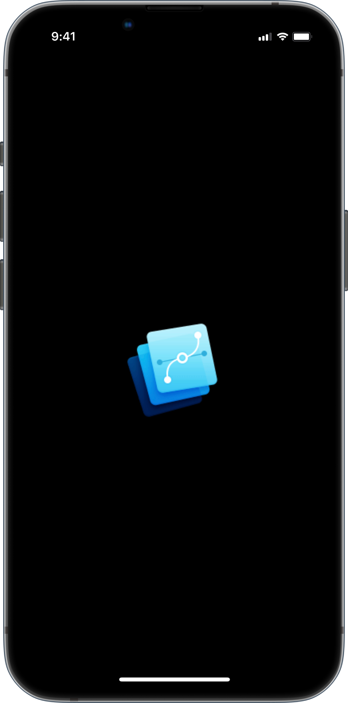
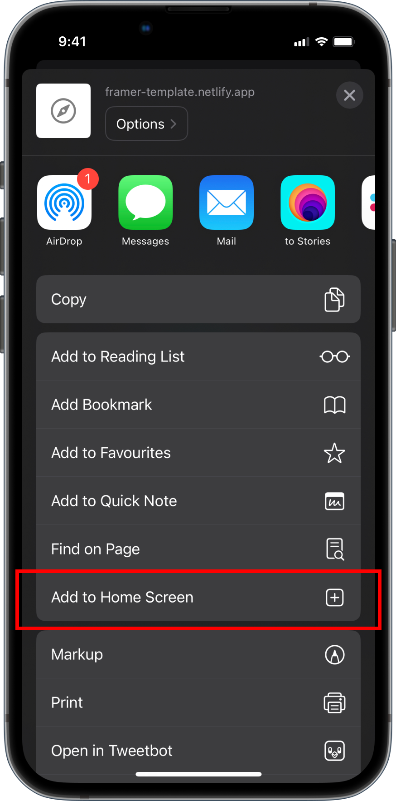

# Framer starter template

A starter template with webpack to help you prototype in FramerJS with JavaScript.
Original Framer library: https://github.com/koenbok/Framer

### Setup

Make sure you have `node` and `npm` installed.
Clone this repo

```
git clone git@github.com:zeroxme/framer-template.git
```

then

```
cd framer-template
npm install
```

### How to use it

To run the project in your local server

```
npm start
```

Then in your browser, go to `http://localhost:3000`
Or run it on your mobile device, go to `[your local ip address]:3000` for example `http://192.168.2.151:3000`



The best way to run it full screen on your device is to open it on Safari (iOS) or Chrome (Android) then `Add to home screen`



Start making changes to `src/app.js` and see your changes apply

To build and deploy locally

```
npm run build
```
I've uploaded the example on Netlify https://framer-template.netlify.app/

### Documentation

For Documentation is https://docs.prototyper.design/
Prototyper documentation is pretty much the same. The only difference is that anything that starts with `Prototyper` should be `Framer` instead.
<b>WIP</b>: To bring back the original Framer documentation.

### Warning

Please don't make changes to `public/` folder as it has everything Framer related so it can work

### Collaborate

For any questions or issues, feel free to open an issue here.
find me [@zerox_me](https://twitter.com/zerox_me)
